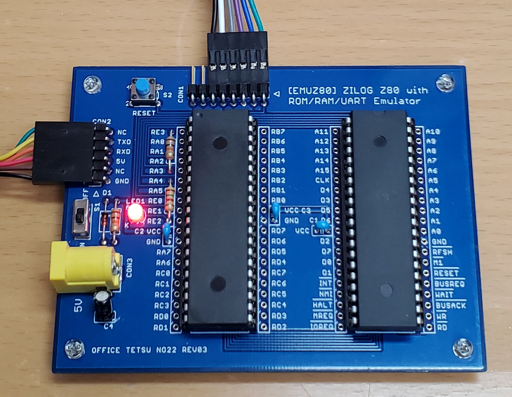
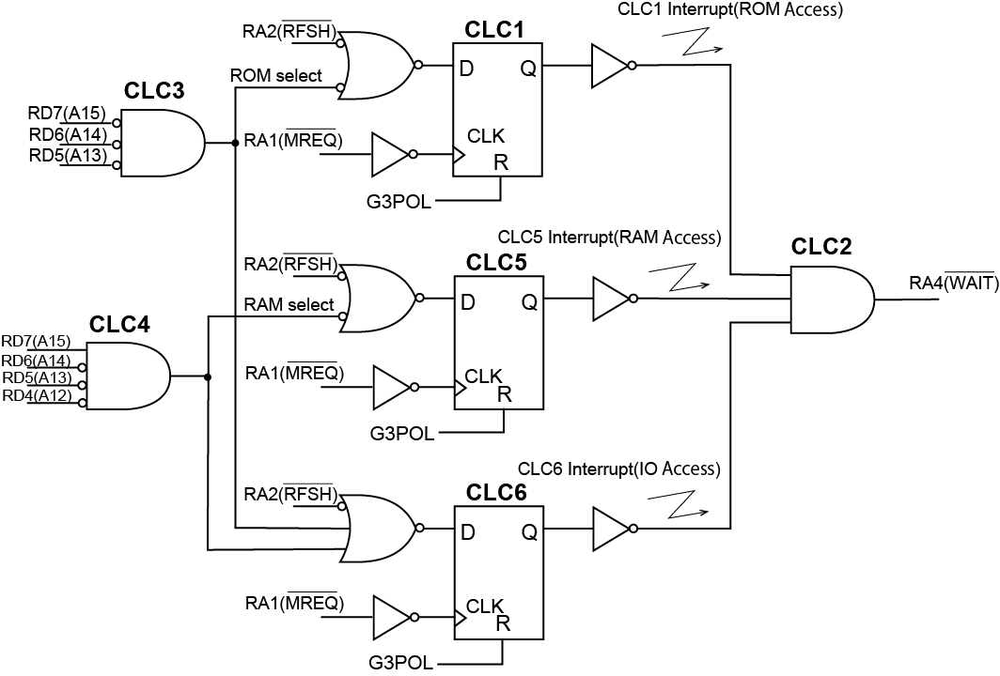
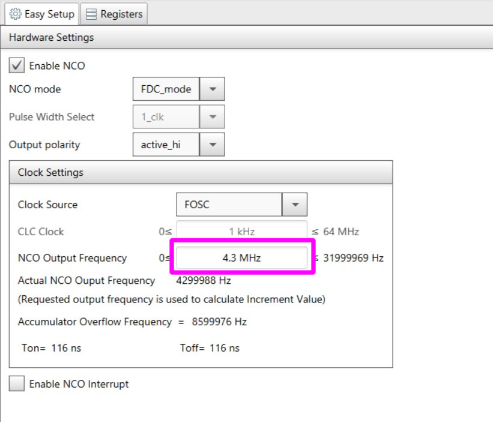

# EMUZ80_hayami
EMUZ80 Modify by Hayami

電脳伝説さん(@vintagechips)のEMUZ80をMCC化/高速化したバージョンです。
* emuz80_pic.hex 
PIC18F47Q43にPICkit4等で書き込むことでEMUZ80がさらに高速なマイコンボードとなります。後述の emuz80_clcプロジェクトをビルドした HEXファイルです。
<figure>
    
    <figcaption>emuz80マイコンボード</figcaption>
</figure>

## emuz80_mcc
---
MPLAB X のモジュールソース作成機能を利用するために、オリジナルのバージョンをMCC（MPLAB Code Configurator)を使って構築できるようにしました。
* CLC1     ：Configurable Logic Cell
* NCO1     ：Numerical Controlled Oscillator
* EXT_INT：External Interrupt
* UART3    ：Serial Communication

以上のモジュールを追加して、オリジナルと同じ機能を構築してあります。
動作スピードは、オリジナルより数秒遅くなりました。
emuz80_mcc.X フォルダにビルドに必要なファイルが入っています。このプロジェクトをベースにした高速化などの様々なアプローチにチャレンジできると思います。

## emuz80_clc
---
CLCを6個使うことで、ROMアクセス、RAMアクセス、IOアクセスの3種類の割り込み処理を行います。
それぞれの割り込み先処理は、シンプルで単機能なため、そこをPIC18インラインアセンブラで、記述して高速化を図っています。
<figure>
    
    <figcaption>emuz80_clc論理回路図</figcaption>
</figure>
emuz80_clc.X フォルダにビルドに必要なファイルが入っています。プロジェクトを開いた後、MCCを起動して NCO1モジュールを選択すると次の設定画面が表れます。
<figure>
    
    <figcaption>MCC_NCO1</figcaption>
</figure>
NCO Output frequency の数値を変更することで最適な動作クロックを供給することができます。Generateボタンをクリックすことで、自動的にプログラムソースが作成されます。
Zilog Z84C0008PEG では、4.3MHzが最速解でした。
emuz80_clc.X フォルダにビルドに必要なファイルが入っているので数値を変えて、
お持ちのZ80 における最速解を追求してみてください。

## BUILD 環境
---
MPLAB X v6.0  
MCC(MPLAB Code Configurator) 5.1.2  
XC8 v2.36
* ビルドエラーが発生する場合
  CLCモジュールを設定変更すると clcx.c　が変わってしまいビルドエラーが発生することがあります。その際は clcx.c 内の(x=1,5,6)
　　void __interrupt(irq(CLCx),base(8)) CLCx_ISR()
  をコメントアウトして main.cの同処理とダブらないようにしてください。
* for EMUZ80
